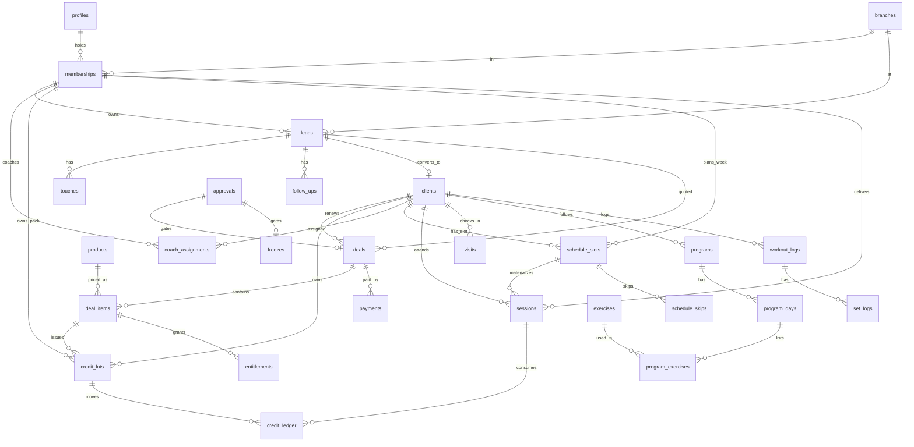

# 02 — Data model

Postgres on Supabase. Table names are plural `snake_case`. Every table has `id uuid default gen_random_uuid()` unless noted, `created_at timestamptz default now()`, and RLS enabled. Money is `bigint` piastres (100 piastres = 1 EGP). Times are `timestamptz`; business-day logic converts to `Africa/Cairo`.

The authoritative definition is `supabase/migrations/0001_init.sql`. This document explains intent and invariants so that nobody has to reverse-engineer them from DDL.

## 1. Identity and org

### `branches`
One row per branch. `code` (`A`, `B`) is used in UI and analytics. `settings_override jsonb` lets a branch override a global setting (e.g. opening hours).

### `profiles`
One row per human who can log in, keyed by `auth.users.id`. Holds `full_name`, `phone` (E.164, unique), `email`, `gender`, `date_of_birth`, `preferred_language`. No role here — roles are memberships.

### `memberships`
`(profile_id, branch_id, role)` unique. `role` is the enum `app_role`: `top_management, head_coach, coach, nutritionist, sales_manager, sales_rep, front_desk, client`. Staff-only columns: `capacity` (max active clients for a coach), `specialties text[]` (e.g. `rehab`, `powerlifting`, `prenatal`), `rotation_paused` (round robin skip), `discount_allowance_pct` (rep can discount up to this without approval). `is_active=false` deactivates without deleting history.

Invariants: top management memberships have `branch_id null` (all branches). Sales manager has one membership per branch. A head coach must also hold a `coach` membership in the same branch; the trigger `tg_head_coach_needs_coach` creates it automatically when a head coach membership is inserted.

### `settings`
`key text primary key, value jsonb`. All tunables from `docs/06-DECISIONS.md`. Read via `fn_setting(key)` which returns jsonb, with `fn_setting_int`, `fn_setting_bool`, `fn_setting_text`, `fn_setting_num` helpers. Writable by top management only.

## 2. Sales

### `lead_sources`
Configurable list: `walk_in, instagram, referral, website, event, phone, other` seeded.

### `leads`
The prospect before they pay. Key columns:
- `branch_id`, `full_name`, `phone` (E.164, unique among non-lost leads via partial index), `email`, `source_id`, `referred_by_client_id`, `interest_tags text[]` (e.g. `{pt,nutrition}`).
- `owner_membership_id` — the sales rep. Null means unassigned (inbound queue).
- `status` enum `lead_status`: `new, contacted, onboarded, quoted, won, lost`. `lost_reason` enum `lost_reason`: `price, location, timing, went_elsewhere, no_response, not_interested, duplicate, other` + `lost_note`.
- Onboarding: `onboarding_token` (24 random bytes, base64url), `onboarding_token_expires_at`, `onboarding_completed_at`, `onboarding_responses jsonb`, `onboarding_schema_version int`. The token authorizes the public wizard; the wizard writes only through `fn_submit_onboarding(token, step, answers)`.
- `instagram_handle`, `consent_marketing`, `consent_content`.
- SLA: `first_contact_due_at` (set on creation from opening hours + SLA setting), `first_contact_at` (set by first touch).
- Review: `review_status` enum `review_status`: `not_required, pending, approved, rejected`; `reviewed_by`, `reviewed_at`, `review_note`.
- `converted_client_id` set by `fn_convert_lead`.
- `created_by` (profile), `updated_at`.

Invariants (all enforced in the DB): `status='lost'` requires `lost_reason`; `status='won'` requires `converted_client_id` (check constraints). `owner_membership_id` must be a `sales_rep` or `sales_manager` membership in the same branch (trigger). Direct updates from the app are limited to editorial columns (name, email, source, tags, handle, consents); `status`, `owner_membership_id`, onboarding and review fields change only through `fn_*`.

### `touches`
Every interaction with a lead or client: `type` enum `touch_type` (`call, whatsapp, visit, email, instagram, note`), `direction` (`outbound, inbound`), `note`, `by_profile_id`, `occurred_at`. Exactly one of `lead_id`/`client_id` is set. First outbound touch on a lead sets `leads.first_contact_at` (trigger).

### `follow_ups`
Tasks: `title`, `due_at`, `assigned_to_membership_id`, `status` (`open, done, skipped`), `completed_at`, exactly one of `lead_id`/`client_id`. Home screen of a rep = today's and overdue follow-ups.

### `round_robin_state`
`branch_id pk, last_membership_id`. Cursor for `fn_round_robin_next`.

## 3. Catalog and money

### `products`
`type` enum `product_type`: `membership, pt_pack, nutrition, bundle`. Columns used per type:
- membership / nutrition: `duration_days`.
- pt_pack: `session_count`, `expiry_days`, `session_minutes` (default 60).
- bundle: rows in `bundle_items` (`bundle_product_id, product_id, qty`).
- all: `price_piastres`, `branch_id` (null = all branches), `is_active`, `sort_order`.
`per_session_value_piastres` is a generated column for pt_pack = price / session_count.

### `deals`
The commercial agreement. `branch_id` (not null), `lead_id` or `client_id` (renewals have `client_id`). `first_paid_at` (booked revenue is dated here), `paid_at` (fully paid). `rep_membership_id` = attributed seller. `closer_membership_id` = who actually closed (may be a coach on renewals). `status` enum `deal_status`: `draft, pending_approval, approved, partially_paid, paid, cancelled`. Discount input: `discount_pct` or `discount_fixed_piastres` (the larger resulting amount wins, capped at the subtotal). Money snapshot: `subtotal_piastres, discount_piastres, total_piastres, paid_piastres` (written by `fn_price_deal` / `fn_record_payment`). `payment_plan` enum: `single, installments` + `installments_count`. `approval_id`, `approved_by`, `approved_at` when approval was involved. `is_renewal`, `notes`, `created_by`, `paid_at` when fully paid.

Invariants: totals are only written by `fn_price_deal`. Status only changes through `fn_submit_deal`, `fn_decide_approval`, `fn_record_payment`, `fn_cancel_deal`. In `draft` the app may edit `discount_pct, discount_fixed_piastres, payment_plan, installments_count, notes, is_renewal, closer_membership_id` and the items; everything else is column-grant protected. `deal_items` are frozen once status leaves `draft` (RLS).

### `deal_items`
`product_id, qty, unit_price_piastres, line_total_piastres`, plus snapshots `product_type`, `session_count`, `duration_days`, `expiry_days` copied from the product at pricing time so later catalog edits don't change history. `provider_membership_id`: for a PT pack, the coach it is sold under (required — `fn_price_deal` refuses otherwise); for nutrition, the nutritionist (optional). `fn_record_payment` branches on `product_type`. `credits_issued` counts how many sessions have been released (for installments).

### `payments`
`deal_id, amount_piastres, method` enum `payment_method` (`cash, card, instapay, bank_transfer, other`), `reference`, `received_at`, `recorded_by`, `voided_at`, `void_reason`. Voiding requires an approval and reverses credits not yet consumed.

### `approvals`
Generic approval request: `type` enum `approval_type` (`discount, installments, freeze, refund, transfer, attendance_edit, payment_void, lead_reassign, expiry_extension`), `subject_table`, `subject_id`, `requested_by`, `reason`, `status` (`pending, approved, rejected`), `decided_by`, `decided_at`, `decision_note`, `payload jsonb`. `fn_decide_approval` applies the side effect per type.

## 4. Clients and entitlements

### `clients`
The paying person. `profile_id` is null until the provisioning Edge Function creates the auth user, then set. `home_branch_id`, `full_name`, `phone`, `email`, `gender`, `date_of_birth`, `lead_id`, `rep_membership_id` (attributed rep), `coach_membership_id` (current coach, kept in sync with `coach_assignments` by `fn_set_primary_coach`), `nutritionist_membership_id`, `status` enum `client_status` (`active, frozen, lapsed` — nothing is ever archived or deleted), `joined_at`, `onboarding_responses` (copied from lead), `injuries`, `instagram_handle`, `risk_score int`, `risk_reasons jsonb`, `last_visit_at`, `updated_at`. App-editable columns: `full_name, email, gender, date_of_birth, injuries, instagram_handle, onboarding_responses, nutritionist_membership_id`; `status`, `coach_membership_id`, `risk_*`, `phone`, `home_branch_id` change only through functions and jobs.

`lapsed` = no active entitlement and no credits. Set by the nightly job.

### `coach_assignments`
History: `client_id, coach_membership_id, assigned_by, reason, started_at, ended_at, end_reason`. Exactly one open row (`ended_at is null`) per client (partial unique index). Opened by `fn_set_primary_coach` when a pack is paid (reason "PT pack purchased") or when the head coach reassigns (`fn_assign_coach`).

### `entitlements`
Time-based rights from paid deal items: `client_id, deal_item_id, product_id, type` (`membership, nutrition`), `starts_at, ends_at, status` (`active, frozen, expired, cancelled`). Membership entitlement is what makes a client "a member" for check-in.

### `credit_lots`
Each paid PT line item (or installment) creates a lot: `client_id, deal_item_id, coach_membership_id` (the pack belongs to this coach; sessions with another coach cannot burn it), `qty_issued, qty_remaining, per_session_value_piastres` (gross = line total ÷ sessions), `tax_pct` (snapshot of `commission.tax_pct`), `net_per_session_value_piastres` (gross × (100 − tax) ÷ 100; the commission base), `issued_at, expires_at, status` (`active, exhausted, expired, refunded`). Deferred liability = Σ `qty_remaining × per_session_value` over active lots. Reassignment moves active lots to the new coach; an approved expiry extension revives an expired lot with its unused sessions.

### `credit_ledger`
Append-only movement log: `client_id, lot_id, session_id, entry_type` enum `credit_entry_type` (`issue, consume, expire, refund, adjust, restore`), `qty` (+/-), `reason`, `created_by`. Balance = `fn_credit_balance(client_id, coach_membership_id?)` = Σ `qty_remaining` of active, unexpired lots, optionally for one coach; `fn_credit_balances(client_id)` lists it per coach. The ledger is for audit; lots are for balance. A `consume` always references the lot it burned (FIFO by `expires_at` among that coach's lots).

### `freezes`
`client_id, starts_at, ends_at, approval_id, status` (`pending, active, ended, rejected`), `days`. On end, active lots and entitlements are extended by `days`.

## 5. Coaching

### `coach_availability`
Working hours: `membership_id, weekday (0=Sun..6=Sat), start_time, end_time`. Used to compute free gaps in the week view, utilization, and by the coach suggester (time preference overlap).

### `schedule_slots`
The coach's recurring weekly schedule. `coach_membership_id, branch_id, weekday, start_time, duration_minutes, kind` enum `slot_kind` (`client, class, blocked`), `client_id` (required iff `kind = client`), `label` (class name / reason), `starts_on, ends_on, is_active, created_by, updated_at`. Written only by `fn_upsert_schedule_slot` / `fn_end_schedule_slot` (overlap check per weekday; a client slot requires credits with that coach). Audited.

### `schedule_skips`
`slot_id, skip_date, reason` — a slot does not run on that date (holiday, client travelling). `fn_skip_slot` also cancels the already-materialized session for that date.

### `sessions`
A PT session for one day: materialized from a weekly slot (`slot_id` set, unique per slot and time), added as a one-off (`fn_add_session`), or a walk-in (`is_walk_in`). `client_id, coach_membership_id, branch_id, scheduled_at, duration_minutes, status` enum `session_status` (`booked, completed, no_show, cancelled`), `outcome_recorded_at, outcome_recorded_by, lot_id` (credit consumed from), `credit_consumed bool`, `waived bool, waive_reason`, `unpaid bool` (delivered with zero credits; `settled_at` when a later pack paid for it), `cancel_reason`, `notes`, `updated_at`.

Invariants: outcome is written only by `fn_record_attendance` / `fn_cancel_session` (the app can update `notes` directly, nothing else — column grant). Edits after `attendance.edit_window_hours` need an `attendance_edit` approval. `credit_consumed` is true iff the last credit movement referencing this session is a `consume`. `unpaid` sessions are settled FIFO by `fn_settle_unpaid_sessions` when the client pays a new pack under the same coach.

### `visits`
Any member entering a branch: `client_id, branch_id, checked_in_at, method` (`qr, phone, staff, session`), `recorded_by`. Foot traffic and "last visit" come from here. A completed session also inserts a visit (`method = session`) if none exists in the previous 3 hours.

### `exercises`
Library: `name, muscle_group, equipment, movement_pattern, video_url, cues, is_active, created_by`. Seeded with ~150 rows.

### `program_templates`
`name, owner_membership_id` (null = gym-wide), `branch_id` (null = all), `structure jsonb` (same shape as a program's days/exercises).

### `programs` → `program_days` → `program_exercises`
Program: `client_id, coach_membership_id, name, goal, starts_at, ends_at, status` (`draft, active, archived`), `weeks`. Day: `program_id, day_index, name` (e.g. "Day 1 — Lower"). Exercise: `program_day_id, exercise_id, order_index, sets, reps` (text, allows "8-10"), `tempo, rest_seconds, target_weight_kg, notes, superset_group`.

One active program per client (partial unique index).

### `workout_logs` → `set_logs`
Client's actual training: `client_id, program_day_id, session_id, performed_at, duration_minutes, notes, synced_at`. Sets: `workout_log_id, program_exercise_id, exercise_id, set_index, weight_kg, reps, rpe, is_pr`. `is_pr` computed by trigger against the client's history for that exercise (weight × reps estimated 1RM).

### `body_metrics`
`client_id, measured_at, weight_kg, body_fat_pct, measurements jsonb, source` (`client, coach`).

### `nutrition_plans`
`client_id, owner_membership_id, targets jsonb` (kcal, protein, carbs, fat), `notes, file_url, starts_at, ends_at, status` (`draft, active, archived`).

### `client_notes`
`client_id, author_membership_id, body, visibility` (`coaching, sales, all`). Coaching notes are not visible to sales and vice versa; `all` is visible to both.

## 6. Governance and analytics

### `events`
Append-only: `id bigserial, type text, actor_profile_id, branch_id, subject_table, subject_id, payload jsonb, occurred_at`. Types are namespaced strings: `lead.created, lead.assigned` (payload carries from/to on reassignment)`, lead.stage_changed, lead.reviewed, lead.onboarding_sent, lead.onboarded, rep.rotation_changed, deal.submitted, deal.approved, deal.cancelled, deal.paid, payment.recorded, payment.voided, credit.issued, credit.consumed, credit.restored, credit.expired, credit.expiry_extended, client.created, client.flagged, client.lapsed, coach.assigned, coach.reassigned, schedule.slot_upserted, schedule.slot_ended, schedule.slot_skipped, session.added, session.completed, session.no_show, session.cancelled, session.unpaid, session.settled, visit.recorded, program.activated, workout.logged, freeze.started, freeze.ended, approval.requested, approval.decided, job.nightly, setting.updated, membership.saved, staff.created, profile.activation_changed, touch.logged, follow_up.created, follow_up.completed, deal.created, product.saved, client.provisioned, availability.updated, client.note_added, program.created, template.saved, client.profile_updated`. Every `fn_*` emits; `program.activated` and `workout.logged` come from triggers because those tables are written directly under RLS.

### `audit_log`
Trigger-populated for `deals, deal_items, payments, credit_lots, credit_ledger, sessions, coach_assignments, approvals, settings, memberships, freezes, schedule_slots, schedule_skips`: `table_name, row_id, branch_id` (derived from the row's `branch_id` / `home_branch_id` / `client_id` / `deal_id`), `action, old_row, new_row, actor_profile_id, occurred_at`. Head coaches and sales managers read only their branch's rows.

### `notifications`
`recipient_profile_id` (nullable), `client_id` (nullable; one of the two is set), `type, title, body, data jsonb, channel` (`in_app, whatsapp, email, push`), `status` (`pending, sent, failed, read`), `read_at, sent_at, error`. Created by `fn_notify` (profile), `fn_notify_role` (every holder of a role in a branch) and `fn_notify_client` (client — queued on the client row when no account exists yet; `provision-client` backfills the recipient). Delivered by the `notify` Edge Function; in-app rows reach the app through Realtime.

### `targets`
`period` (`YYYY-MM`), `scope_type` (`branch, membership`), `scope_id`, `metric` (`won_revenue, delivered_revenue, new_clients, sessions_completed, retention_pct`), `value numeric`. Unique per (period, scope_type, scope_id, metric).

### Materialized views (0002)
- `mv_daily_branch` — per branch per day: leads, won, revenue booked / collected / delivered, sessions completed, no-shows, cancelled, unpaid, visits, new clients.
- `mv_coach_month` — per coach per month: sessions completed, no-shows, cancelled, unpaid, credits burned, no-show %, clients seen, delivered revenue gross and net, `commission_pct` (tier from `fn_pt_commission_pct`), `commission_piastres`, renewals, active clients, utilization.
- `mv_rep_month` — per rep per month: leads, contacted, onboarded, quoted, won, lost, conversion, SLA breaches, median response minutes, won revenue, money collected split by item type (membership / nutrition / PT, pro-rata per payment), `commission_piastres` on membership (+ nutrition placeholder).
- `mv_client_adherence` — per client, trailing 30 days: scheduled, completed, no-shows, cancelled, adherence %, unpaid sessions, workouts logged, last visit, credits left, next expiry, risk score. This is the coach's "who is slacking" list.
- `mv_heatmap` — per branch, weekday, hour: sessions and visits over the last 8 weeks.
- `mv_liability` — per branch and coach: remaining credits × value.
- `mv_source_roi` — per branch, source, month: leads, won, won revenue.
- `mv_retention_cohort` — per branch and join month: cohort size and members still visiting at M+1/2/3/6.

### Materialized views (0011, M6)
- `mv_coach_month` and `mv_daily_branch` rebuilt: burned and delivered figures come from `sessions.credit_consumed` and the session's lot, by the delivering coach and the Cairo date (0002 counted `consume` ledger rows by the lot's current coach, so restores and reassignments skewed them). `mv_daily_branch` gains `revenue_delivered_net`.
- `mv_coach_week` — per coach per gym week (Saturday start), last 12 weeks: sessions completed, no-shows, credits burned.
- `mv_branch_month` — per branch per month: booked deals and revenue, collected on booked, outstanding, leads, median response, membership collected, sales commission (rounded at branch level, like the report).
- `mv_rep_extra` — per rep per month: discounted deals and discount given, FLAG tasks handled and their median hours, expiry extensions requested.
Refreshed by `fn_refresh_views(false)` every 5 minutes via pg_cron (every view except the retention cohort — 0011) and `fn_refresh_views(true)` nightly (all). `pnpm seed:auth` runs a full refresh so a fresh reset shows numbers at once. The app never selects the views directly; it calls the scoped accessors `fn_dashboard_daily/coaches/reps/adherence/heatmap/liability/sources/retention` and `fn_today_live`, which apply the caller's role and branch.

## 7. Helper functions (`0001_init.sql`; jobs, commission and dashboard accessors in `0002_analytics.sql`)

Auth helpers (STABLE, used by RLS): `my_profile_id()`, `my_roles()` → table(role, branch_id), `has_role(role, branch_id)`, `is_top_management()`, `is_staff()`, `my_branch_ids()`, `my_membership_ids()`, `my_client_id()`, `my_coach_client_ids()` (clients I coach or nutrition-coach, plus every client in branches where I am head coach), `my_sales_client_ids()` (clients I sold to, plus every client in branches where I am sales manager or front desk), `my_lead_ids()` (leads I own, plus every lead in branches where I am sales manager), `is_coach_of_branch(branch_id)`.

Settings helpers: `fn_setting(key)` → jsonb, `fn_setting_int/bool/text/num(key, default)`.

Business functions (SECURITY DEFINER, check permissions inside, emit events). Sales: `fn_create_lead`, `fn_assign_lead`, `fn_round_robin_next`, `fn_set_rotation_paused`, `fn_set_lead_stage`, `fn_review_lead`, `fn_issue_onboarding_token`, `fn_submit_onboarding` (anon), `fn_flag_for_sales` (+ internal `fn_flag_for_sales_internal`), `fn_extend_expiry` (→ `fn_apply_expiry_extension`). Money: `fn_price_deal`, `fn_submit_deal`, `fn_cancel_deal`, `fn_request_approval`, `fn_decide_approval`, `fn_record_payment` (→ `fn_issue_credits`, `fn_set_primary_coach`, `fn_settle_unpaid_sessions`), `fn_convert_lead`, `fn_credit_balance`, `fn_credit_balances`. Coaching: `fn_rank_coaches(client_id | lead_id)`, `fn_assign_coach` (head-coach reassignment), `fn_upsert_schedule_slot`, `fn_end_schedule_slot`, `fn_skip_slot`, `fn_materialize_sessions`, `fn_coach_day`, `fn_add_session`, `fn_cancel_session`, `fn_record_attendance` (→ internal `fn_apply_attendance`, `fn_consume_credit`, `fn_restore_credit`), `fn_start_walkin_session`, `fn_check_in`. Freezes and jobs: `fn_request_freeze`, `fn_end_freeze`, `fn_expire_credits`, `fn_compute_risk_scores`, `fn_mark_lapsed`, `fn_nightly`, `fn_hourly_notifications`, `fn_refresh_views`, `fn_pt_commission_pct`. Plumbing: `fn_emit_event`, `fn_notify`, `fn_notify_role`, `fn_notify_client`, `fn_normalize_phone`, `fn_within_opening_hours`. Admin (0004, top management only): `fn_update_setting` (keeps the value's JSON type; validates `commission.pt_tiers`), `fn_create_staff_profile`, `fn_save_membership`, `fn_set_profile_active`; any user: `fn_mark_notifications_read(ids?)` (own rows). Sales (0006): read shapes scoped like the leads RLS — `fn_sales_leads(branch, status?, search?)`, `fn_sales_lead(id)` (detail incl. touches, follow-ups, deals, onboarding), `fn_find_by_phone` (duplicate check, details only when visible), `fn_sales_today(branch)`, `fn_sales_queue(branch)` (sales manager), `fn_sales_team(branch, month)`, `fn_sales_reps(branch)`, `fn_lead_breakdown(branch, month)`; writes `fn_log_touch`, `fn_add_follow_up`, `fn_complete_follow_up`; public `fn_onboarding_state(token)` (wizard resume). Money (0008): read shapes scoped like the deals RLS (`fn_can_see_deal`) — `fn_deal_catalog(branch)` (sellable products, a branch row overrides the all-branches row, per-session gross/net), `fn_branch_coaches(branch)`, `fn_deal(id)` (items, issues, server totals, `approval_preview` = `fn_deal_approval_preview`, payments, timeline, allowed actions, remaining, minimum first payment), `fn_sales_deals(branch, status?, search?)`, `fn_sales_approvals(branch)` (pending approvals with their subject), `fn_sales_client(client)` (lots incl. expired, entitlements, deals, extension rights); top management only: `fn_money_summary(month, branch?)`, `fn_commission_report(month, branch?)` (reads `mv_coach_month`, `mv_rep_month`, `mv_liability`); writes `fn_create_deal(lead?, client?)` (reuses an open draft), `fn_save_deal_draft` (replaces items, prices through `fn_price_deal`), `fn_request_payment_void` (→ `payment_void` approval), `fn_save_product`, `fn_save_bundle_items` (sales manager / top management). Coaching (0009): read shapes scoped like `fn_coach_day` (coach, branch head coach, sales manager, top management) — `fn_coach_week(coach, week_start)` (working hours, slots active that week with skipped dates and sessions left), `fn_schedulable_clients(coach)`, `fn_coach_today(coach, date)` (materializes the day first when it is today or later; sessions with sessions left, unpaid, injuries, late / pending-approval flags; classes and blocked slots; the coach's open follow-ups), `fn_coach_clients(coach)` (live 30-day adherence, same formula as `mv_client_adherence`), `fn_coach_client(client)`, `fn_program(program)`, `fn_program_templates()`, `fn_coach_team(branch, month)` (head coach: coaches with `mv_coach_month`, branch clients, pending attendance edits, waivers, decided late edits, unpaid sessions); writes `fn_add_weekly_slots` (one slot on several weekdays, all or nothing, the failing weekday named), `fn_set_availability`, `fn_add_client_note`, `fn_save_program` (creates or rewrites a draft), `fn_new_program_version` (draft copy of an active program), `fn_activate_program` (archives the previous active program), `fn_save_template`, `fn_kiosk_check_in(phone, branch)`, `fn_kiosk_notify_sales(client, branch)`. 0009 also inserts two gym-wide starter templates whose exercises are named, resolved on read. Client app (0010): read shapes for the signed-in client (`fn_require_client` → `my_client_id` scope) — `fn_client_home()` (sessions left per coach, membership end, next session from booked sessions or the next occurrence of a weekly slot, the coach's slots read-only, active program and suggested day), `fn_client_training()` (active program, suggested day, per exercise the last workout's sets and best estimated 1RM), `fn_client_progress(exercise?)` (PRs, top-set series, weekly streak of workouts or visits, body weight), `fn_client_credits()` (balances = `fn_credit_balances`, packs, ledger, payments, memberships, freezes, advisor, open renewal); writes `fn_update_my_profile` (training preferences, consents, Instagram, language), `fn_client_check_in(branch?, code?)` (one tap within an hour of a booked session, or the kiosk QR code of the day; admission by `fn_check_in`, visit method `qr`), `fn_kiosk_code(branch)` (staff). `app_secrets` holds the kiosk QR secret (RLS on, no grants). Clients write `workout_logs`, `set_logs`, `body_metrics` directly with ids made on the phone, so an offline replay (`ON CONFLICT (id) DO NOTHING`) never duplicates. Dashboard accessors (0002): `fn_dashboard_daily/coaches/reps/adherence/heatmap/liability/sources/retention`, `fn_today_live`. Analytics (0011): `fn_dashboard_tiles(screen, month, scope)` (screen `coach` = a coach membership, `rep` = a rep membership, `sales` = a branch, `admin` = a branch or all; who may see what in `fn_dashboard_can`), `fn_dashboard_rows(metric, month, scope, extra)` (the rows behind a tile, ≤ 500, with count and `fn_metric_total`; built by `fn_metric_rows`), `fn_pt_tier_meter(sessions)`, `fn_dashboard_coach_weeks(branch?)`, `fn_dashboard_branch_month(month)`, `fn_dashboard_rep_extra(month)`, `fn_dashboard_weekly(weeks)`, `fn_dashboard_targets(period, all?)`, `fn_audit_explorer(source, table?, actor?, from?, to?, search?, limit)` (top management; `events` or `audit_log` with old/new rows); writes `fn_save_target(period, scope_type, scope_id, metric, value)` (top management; null clears; emits `target.saved`). `events` is in the `supabase_realtime` publication (the admin today strip refetches on every insert; RLS decides who receives it).

## 8. ERD (core)

